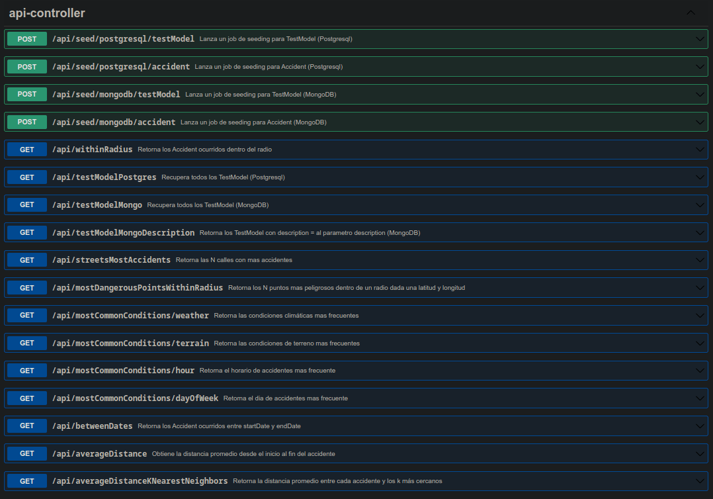

# Bases de datos 2 2022 - Trabajo de Promoción

## Descripción del Dataset US Accidents

Se provee una descripción del dataset en el archivo [DATASET-ABOUT.MD](DATASET-ABOUT.MD).

## Documentación OpenAPI
Se documenta la API con OpenAPI, con la dependencia [springdoc-openapi](https://github.com/springdoc/springdoc-openapi).  
Se puede acceder a la interfaz (Swagger UI) para probar los endpoints en la siguiente URL: http://localhost:6868/swagger-ui.html




Alternativamente, se provee una [colección de Postman](bd2-promocion.postman_collection.json).

## Seeding de MongoDB y PostgreSQL desde archivo csv

1. Descargar el archivo [US_Accidents_Dec19.csv](https://www.dropbox.com/sh/g4fo1woljc6j2kw/AACFN-puWJEGv6OxVuNphWGQa/199387_896000_compressed_US_Accidents_Dec19.csv.zip?file_subpath=%2FUS_Accidents_Dec19.csv)  
2. Copiar el archivo `US_Accidents_Dec19.csv` en `./bbdd2PromocionApp/main/resources` antes de buildear la imagen del service app, es decir previo a ejecutar por primera vez:

    ```bash
    docker-compose up
    ```

3. Puede lanzar uno o más jobs de seeding realizando una solicitud POST a los endpoints:

   - **Seeding de TestModel (MongoDB)**  
   `/seed/mongodb/testModel`

   - **Seeding de TestModel (PostgreSQL)**  
     `/seed/postgresql/testModel`

   - **Seeding de Accident (MongoDB)**  
     `/seed/mongodb/accident`

   - **Seeding de Accident (PostgreSQL)**  
     `/seed/postgresql/accident`

## API - Query endpoints

1. /withinRadius 
   
    ```
    Retorna los Accident ocurridos dentro del radio 
    
    - Parametros:
    longitude: una longitud (por ejemplo, '-84.058723')  
    latitude: una latitud (por ejemplo, '39.865147')  
    radius: un radio (en kilómetros, por ejemplo 100)  
    ```

2. /averageDistance

    ```
    Obtiene la distancia promedio desde el inicio al fin del accidente
    ```
   
3. /betweenDates

    ```
    Retorna los Accident ocurridos entre startDate y endDate  
   
    - Parametros:
    startDate: fecha y hora de inicio (por ejemplo: 2016-02-08 06:49:27.000).
    endDate: fecha y hora de fin (por ejemplo: 2016-02-08 09:25:17.000).
    ```
   
4. /streetsMostAccidents
    ```
    Retorna las N calles con mas accidentes  
   
    - Parametros:
    limit: cantidad de Accident a retornar (valor por defecto: 5).
    ```

5. /mostDangerousPointsWithinRadius
    ```
    Retorna los N puntos mas peligrosos dentro de un radio dada una latitud y longitud
   
    - Parametros:
    longitude: una longitud (por ejemplo, '-84.058723')  
    latitude: una latitud (por ejemplo, '39.865147')  
    radius: un radio (en kilómetros, por ejemplo 100)  
    limit: cantidad de Accident a retornar (valor por defecto: 5).
    ```

6. /mostCommonConditions/weather
    ```
    Retorna las condiciones climáticas mas frecuentes
    ```

## Entorno local

Puede ejecutar la API en un entorno local, contando con una instalación válida y propiamente configurada de PostgreSQL y MongoDB.

```bash
cd ./bbdd2PromocionApp
./mvnw spring-boot:run -Dspring-boot.run.jvmArguments='-Dserver.port=6868'
```

También, puede utilizar el docker-compose iniciando unicamente PostgreSQL y MongoDB y configurando los datos en [application-properties](./bbdd2PromocionApp/src/main/resources/application.properties), e iniciar la app localmente:

```bash
sudo docker-compose up postgresdb mongodb
cd ./bbdd2PromocionApp
./mvnw spring-boot:run -Dspring-boot.run.jvmArguments='-Dserver.port=6868'
```

## Docker compose

Puede ejecutar la API en un entorno dockerizado (Spring Boot + PostgreSQL + MongoDB).

### Start the App
We can easily start app with a single command:
```bash
docker-compose up
```

Docker will pull the PostgreSQL, MongoDB and Spring Boot images (if our machine does not have it already).

The services can be run on the background adding the -d parameter:
```bash
docker-compose up -d
```

### Stop the App
Stopping all the running containers is also simple with a single command:
```bash
docker-compose down
```

If you need to stop and remove all containers, networks, and all images used by any service in <em>docker-compose.yml</em> file, use the command:
```bash
docker-compose down --rmi all
```
